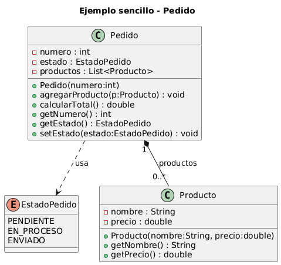

# UML – Práctica 1  
## Introducción a UML y Programación Orientada a Objetos

---

## 📌 Descripción del proyecto

Este proyecto corresponde a la **Práctica 1 de UML**, cuyo objetivo es introducir los conceptos básicos de:

- Diagramas de clases UML
- Programación Orientada a Objetos (POO)
- Relación entre UML y código Java
- Uso de tipos enumerados (`enum`)

El sistema desarrollado modela un ejemplo sencillo de **gestión de pedidos y productos**, donde un pedido puede contener varios productos y es capaz de calcular su importe total.

---

## 🎯 Objetivos de la práctica

- Interpretar un **diagrama de clases UML**
- Traducir un diagrama UML a **código Java**
- Comprender las **relaciones y cardinalidades** entre clases
- Utilizar correctamente **enumeraciones (`enum`)**
- Aplicar encapsulación mediante atributos privados y métodos públicos

---

## 🧩 Diagrama UML

A continuación se muestra el diagrama de clases UML utilizado como base para el desarrollo del proyecto.

---

## 🧱 Estructura del proyecto

El proyecto está compuesto por los siguientes archivos:

- `EstadoPedido.java` → Enumeración que define los posibles estados de un pedido
- `Producto.java` → Clase que representa un producto con nombre y precio
- `Pedido.java` → Clase que gestiona un pedido y su lista de productos
- `Main.java` → Programa principal donde se prueba el funcionamiento del sistema

---

## ⚙️ Funcionamiento del programa

En el método `main` se realizan las siguientes acciones:

1. Se crea un pedido con número identificador.
2. Se crean dos productos con nombre y precio.
3. Se añaden los productos al pedido.
4. Se muestra por pantalla:
   - El número del pedido
   - El estado actual del pedido
   - El total del pedido
5. Se cambia el estado del pedido a **ENVIADO**.
6. Se muestra de nuevo el estado del pedido tras el cambio.

No se utiliza entrada por teclado ni menús interactivos.

---

## 🧠 Análisis UML

### Tipo de relación entre `Pedido` y `Producto`

La relación representada en el diagrama UML es una **composición**, ya que un pedido está formado por uno o varios productos y estos no tienen sentido dentro del sistema sin el pedido que los contiene.

---

### Cardinalidad

La cardinalidad indica que:

- Un pedido puede contener **cero o varios productos (0..*)**
- Cada producto pertenece a **un único pedido (1)**

---

### Tipos de cardinalidad en UML

Algunos ejemplos de cardinalidades posibles en UML son:

- `1..1` → exactamente uno
- `0..1` → cero o uno
- `1..*` → uno o muchos
- `0..*` → cero o muchos

---

### Asociación, agregación y composición

- **Asociación**: relación genérica entre clases.
- **Agregación**: relación todo–parte débil.
- **Composición**: relación todo–parte fuerte, donde la parte depende del todo.

---

## 🚀 Tecnologías utilizadas

- Lenguaje: **Java**
- Modelado: **UML**
- Herramienta UML: **PlantUML**

---

## ✍️ Autor

- Nombre: **Álvaro Pérez**
- Curso: **1FPGS**
- Asignatura: **ENTORNO**

